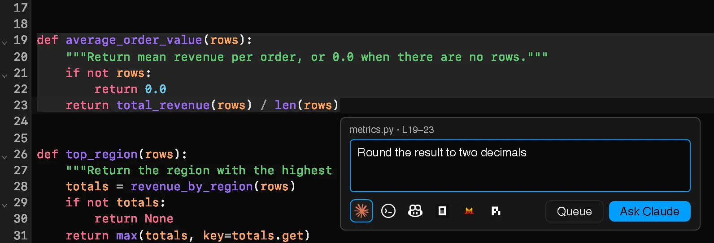

<h1> xtralab</h1>

An opinionated JupyterLab meta-package for coding agents.

xtralab installs JupyterLab with a set of extensions and defaults for work
with terminal coding agents: an agent launcher, side-by-side git diffs for
text files and notebooks, prompts about selected code, and a Model Context
Protocol server that lets agents drive the app. It builds on
[`ajlab`](https://github.com/jtpio/ajlab), the agent-ready JupyterLab base.


See the [documentation](https://jtpio.github.io/xtralab/) for the
[installation](https://jtpio.github.io/xtralab/installation/), a
[getting started tutorial](https://jtpio.github.io/xtralab/getting-started/),
the [features](https://jtpio.github.io/xtralab/features/launcher/), and the
[desktop app](https://jtpio.github.io/xtralab/desktop/).

## Install

```bash
pip install xtralab
jupyter lab
```

To run xtralab in any folder without installing it, use uv:

```bash
uvx --from xtralab jupyter-lab
```

The [installation docs](https://jtpio.github.io/xtralab/installation/) also
show how to install xtralab as a uv tool or add it to a project.

The desktop app (DMG on macOS, AppImage on Linux) is on the
[releases page](https://github.com/jtpio/xtralab/releases/latest). It
includes its own Python runtime. See the
[desktop app docs](https://jtpio.github.io/xtralab/desktop/).

## Highlights

### Agent launcher

Start any coding agent installed on your machine, with an optional first
prompt. The **Changes** list opens the diff of each changed file.
[Read more](https://jtpio.github.io/xtralab/features/launcher/).


### Git diffs

Review changes side by side, for text files and for notebooks, and edit the
working copy in the diff.
[Read more](https://jtpio.github.io/xtralab/features/git-diffs/).


### Ask an agent

Select code, type an instruction, and send it to a new or running agent. The
prompt includes the file path, the line range, and the selected code.
[Read more](https://jtpio.github.io/xtralab/features/ask-agent/).



### Omnibox

Search files and commands, or send a prompt to an agent, from one search box
(<kbd>Cmd/Ctrl</kbd>+<kbd>K</kbd>).
[Read more](https://jtpio.github.io/xtralab/features/omnibox/).


### Terminals panel

See the agent in each terminal and its latest line of output.
[Read more](https://jtpio.github.io/xtralab/features/terminals/).


## Connecting agents to JupyterLab (MCP)

xtralab runs a [Model Context Protocol][mcp-spec] server inside JupyterLab,
provided by [`jupyter-server-mcp`][mcp], so an agent can open files, run
cells, and read notebooks. Register the bundled proxy from a terminal inside
xtralab:

```bash
claude mcp add jupyter -- jupyter-server-mcp-proxy
```

The launcher shows this command for each installed agent. See the
[MCP docs](https://jtpio.github.io/xtralab/agents/mcp/) for Codex, GitHub
Copilot, and other agents.

[mcp]: https://github.com/jupyter-ai-contrib/jupyter-server-mcp
[mcp-spec]: https://modelcontextprotocol.io

## Contributing

See [CONTRIBUTING.md](./CONTRIBUTING.md) for the development setup, the
desktop app architecture, and the documentation sources in [`docs/`](./docs).

## License

BSD-3-Clause
