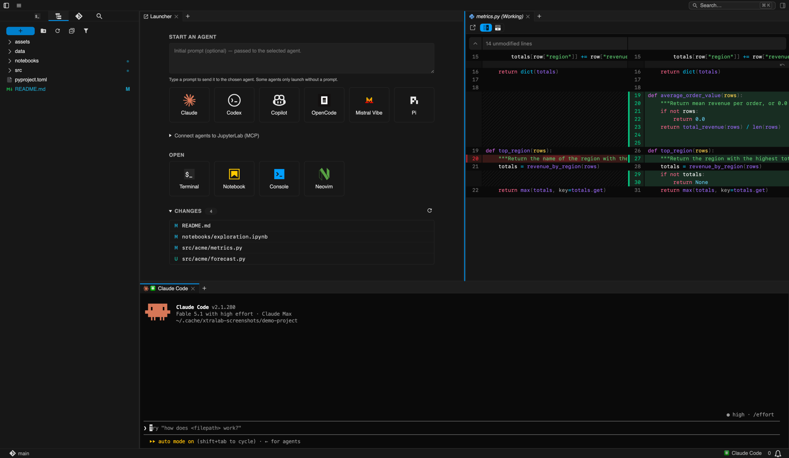
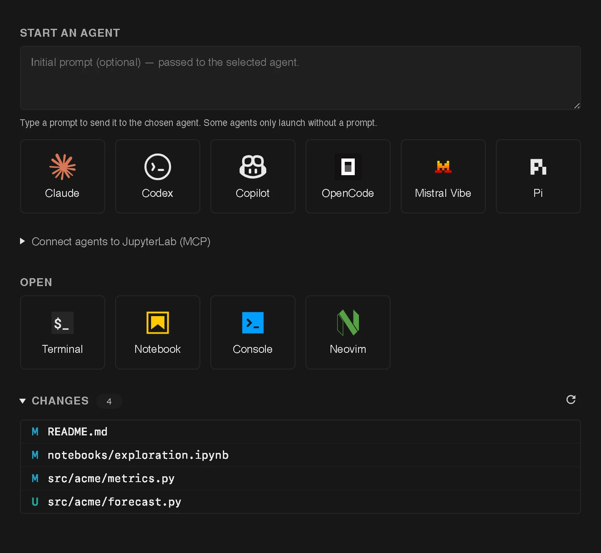
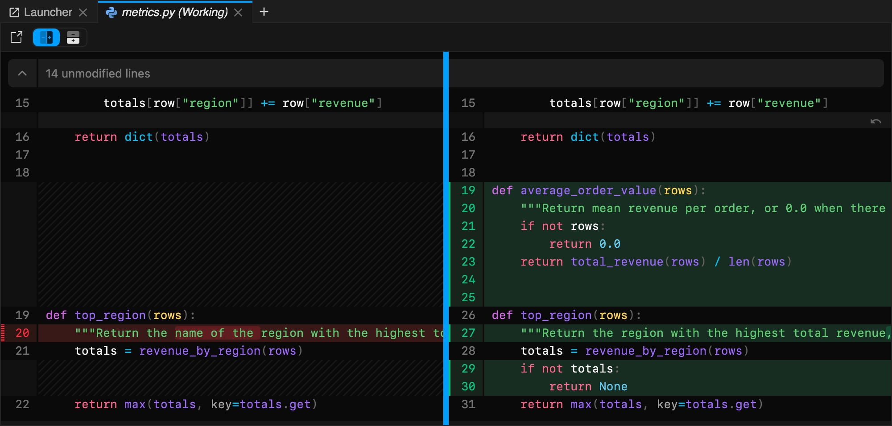
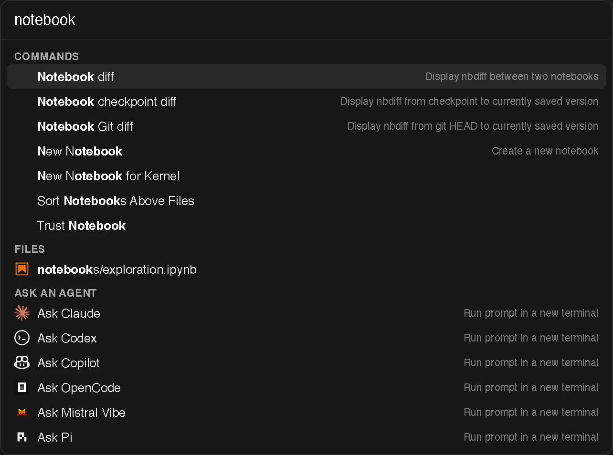
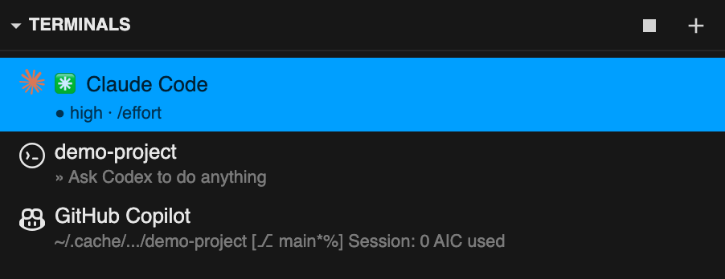

An opinionated JupyterLab meta-package for coding agents.

xtralab reshapes JupyterLab around terminal coding agents. It bundles a curated
set of extensions, a path-first file browser, rich git diffs, an agent launcher,
a Model Context Protocol server that lets agents drive the app, and a quieter set
of defaults. It builds on [`ajlab`](https://github.com/jtpio/ajlab), the
agent-ready JupyterLab base.



## Install

```bash
pip install xtralab
jupyter lab
```

A standalone desktop app (DMG on macOS, AppImage on Linux) ships with every
tagged release on the
[releases page](https://github.com/jtpio/xtralab/releases/latest), and builds
from `main` are uploaded as workflow artifacts on the
[Actions tab](https://github.com/jtpio/xtralab/actions). The macOS build is not
notarized yet, so Gatekeeper blocks it on first launch; you can self-sign it for
free to get native notifications. See [CONTRIBUTING.md](./CONTRIBUTING.md) for
the desktop architecture, local builds, and the signing steps.

## What's included

On top of `ajlab`, xtralab pulls in JupyterLab 4.6+ with `jupyterlab-git`,
`jupyterlab-lsp`, `jupyterlab-quickopen`, `jupyterlab-search-replace`,
`jupyterlab-vim`, and a set of light and dark themes. See
[`pyproject.toml`](./pyproject.toml) for the full list and pinned versions. The
bundled labextension then adds the pieces below.

### An agent launcher



The launcher replaces JupyterLab's stock one with a panel built around how you
actually start work: type an optional prompt, then pick an agent. A button shows
up for each agent installed on your machine (Claude, Codex, Antigravity, Copilot,
Goose, OpenCode, Kiro, Mistral Vibe), and opens a terminal that runs it in your
project. An **Open** row covers a plain terminal, notebook, console, or your
terminal editor (Neovim or Vim), and a **Changes** list jumps straight to the
diff for every modified file.

### Rich git diffs



Opening a changed file shows a real side-by-side diff, powered by `@pierre/diffs`
for text and notebooks, with `@pierre/trees` file-type icons that carry across
the file browser, document tabs, and the `jupyterlab-git` panel. The working-tree
side stays editable, so you can fix a line or discard a hunk without leaving the
diff.

### Ask an agent about the code you are looking at

Select code in a text editor or a notebook cell and a small **Ask agent**
button appears next to the selection (or press
<kbd>Cmd/Ctrl</kbd>+<kbd>.</kbd>). In a git diff, click
or drag over the line numbers and hit the `+` button that shows up in the
gutter. Both open a small prompt box where you describe the change and pick an
agent. The agent starts in a new terminal with your instruction plus the file
path, line range, and selected snippet already filled in, so you can request
fixes the moment you spot them while reading a diff.

### One search box for files, commands, and agents



A single pill in the top bar opens an omnibox that fuzzy-matches across your
files, every JupyterLab command, and an **Ask an agent** row that sends whatever
you typed to the agent of your choice. Prefix the query with `>` for commands
only or `/` for files only. The commands you run and the files you open through
it are remembered and offered again at the top the next time you open it, so a
repeat action is a single Enter away. The number of remembered items is
configurable in the omnibox settings.

### Terminals that show what's running



The Terminals panel lists every running session, badges each one with the agent
or editor detected inside it, and shows its latest line of activity, so a row of
running agents stays readable at a glance. Open terminal tabs in the main area
carry the same icon.

### Quieter, opinionated defaults

Unused UI is hidden for a calmer workspace, the activity bar sits at the top, and
autocompletion, continuous LSP hinting, code folding, and gitignore-aware quick
open are on by default. xtralab ships light and dark themes (Pierre, Cursor, Day,
Night) but picks none for you. See
[the bundled labconfig overrides](./jupyter-config/labconfig) for the full set.

## Connecting agents to JupyterLab (MCP)

xtralab runs a [Model Context Protocol][mcp-spec] server inside JupyterLab,
provided by [`jupyter-server-mcp`][mcp], so an agent can drive the app: open
files, run cells, and read the notebook. To wire up a client, register the
bundled `jupyter-server-mcp-proxy` console script with it:

```bash
claude mcp add jupyter -- jupyter-server-mcp-proxy
codex mcp add jupyter -- jupyter-server-mcp-proxy
copilot mcp add jupyter -- jupyter-server-mcp-proxy
```

Run this from a terminal inside xtralab so the proxy inherits the server
environment and discovers the running server on its own. No port is needed, and a
single registration keeps working across restarts. The launcher also surfaces
these commands with copy buttons, filtered to the agents you have installed. See
the [`jupyter-server-mcp` README][mcp] for other clients.

[mcp]: https://github.com/jupyter-ai-contrib/jupyter-server-mcp
[mcp-spec]: https://modelcontextprotocol.io

## Agent skills

xtralab ships [Agent Skills][skills] at [`agent-skill/`](./agent-skill) that
teach any coding agent how to work with the app:

- **customize-jupyterlab** turns plain-English requests like "hide the status
  bar" or "change the theme" into the right config-file edits.
- **guided-code-walkthrough** drives the running app over the MCP bridge to open
  files, highlight specific lines, and build a read-only walkthrough panel of
  prose, snippets, and diagrams beside the editor, so the agent can _show_ you
  something instead of only describing it in chat.

The same `SKILL.md` files work with Claude Code, Codex CLI, Gemini CLI, GitHub
Copilot, and other tools that read the Agent Skills format. For Claude Code, this
repository doubles as a one-plugin marketplace:

```text
/plugin marketplace add jtpio/xtralab
/plugin install xtralab-skills@xtralab
```

See [`agent-skill/README.md`](./agent-skill/README.md) for other install paths
and what the skills know.

[skills]: https://agentskills.io

## Language servers

xtralab ships [`jupyterlab-lsp`][lsp] with Python pre-registered through
[`ty`](https://github.com/astral-sh/ty), which is bundled and works out of the
box. For TypeScript and JavaScript, install the server yourself and restart
JupyterLab:

```bash
npm install -g typescript-language-server typescript
```

To enable another server (bash, yaml, json, pyright, and more), install its
binary and drop a JSON spec into a `jupyter_server_config.d/` directory; run
`jupyter --paths` to find one. See the [`jupyterlab-lsp` docs][lsp-config] for
the spec.

[lsp]: https://github.com/jupyter-lsp/jupyterlab-lsp
[lsp-config]: https://jupyterlab-lsp.readthedocs.io/en/latest/Configuring.html

## Customizing the launcher

Open **Settings → Settings Editor → xtralab launcher** to override, hide, or add
launcher entries. The editor shows xtralab's full built-in list as the default
for both the `agents` and `editors` settings, so you can read every shipped entry
and copy one into your user preferences to tweak. Both lists merge with the
defaults by `id`, so an override only needs the `id` plus the fields you want to
change:

```jsonc
{
  "agents": [
    { "id": "kiro", "enabled": false }, // hide an agent
    { "id": "claude", "command": "cl" }, // point Claude at a shell alias
    { "id": "aider", "label": "Aider", "command": "aider", "promptArgs": [] }
  ]
}
```

The **Open** row's terminal-editor tile (Neovim, falling back to Vim) is
configured the same way through an `editors` array. Each entry takes `id`
(required) plus optional `label`, `caption`, `command`, `promptArgs`, `iconSvg`,
`rank`, `enabled`, and `requireAvailable`.

## Contributing

See [CONTRIBUTING.md](./CONTRIBUTING.md) for the development setup, the Electron
desktop app architecture, and the build pipeline.

## License

BSD-3-Clause
