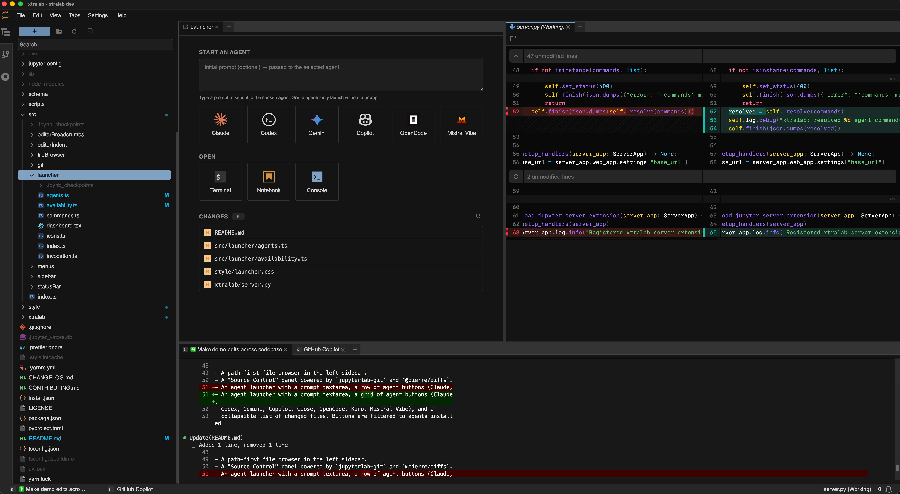

# xtralab

An opinionated JupyterLab meta-package.

Bundles a curated set of extensions, a path-first file browser, the
`jupyterlab-git` panel with its text, notebook and image diffs rendered by
xtralab, an agent-focused launcher, and a quieter default workspace.



## Install

```bash
pip install xtralab
```

## Usage

### As a JupyterLab package

Run JupyterLab the usual way:

```bash
jupyter lab
```

### As a desktop app

A standalone Electron build (DMG on macOS, AppImage on Linux) ships with each
tagged release — grab the installer for your platform from the
[Releases page](https://github.com/jtpio/xtralab/releases/latest). Builds from
the current `main` branch are also produced on every push as workflow
artifacts under the repository's
[Actions tab](https://github.com/jtpio/xtralab/actions). See
[CONTRIBUTING.md](./CONTRIBUTING.md) for the architecture and local build
instructions.

## What's included

- [`ajlab`](https://github.com/jtpio/ajlab) — agent-ready JupyterLab base
- JupyterLab 4.6+
- `jupyterlab-git` — provides the git panel; xtralab swaps its text,
  notebook and image diff rendering for its own
- `jupyterlab-lsp` + `ty` — Python LSP via Astral's `ty` (bundled); also
  detects `typescript-language-server` on `PATH` for JS/TS
- `jupyterlab-quickopen`
- `jupyterlab-cursor-light`, `jupyterlab-cursor-dark`
- `jupyterlab-day`, `jupyterlab-night` themes

The bundled labextension adds:

- A path-first file browser in the left sidebar.
- xtralab-rendered diffs registered as `jupyterlab-git`'s diff providers
  (its own notebook/plain-text/image diff plugins are disabled) so the
  upstream git panel shows xtralab's diffs: `@pierre/diffs` for text and
  notebooks, and an ``-based 2-up/swipe/onion-skin view for images.
- An agent launcher with a prompt textarea, a row of agent buttons (Claude,
  Codex, Gemini, Copilot, Goose, OpenCode, Kiro, Mistral Vibe), and a
  collapsible list of changed files. Buttons are filtered to agents installed
  on the machine; a typed prompt is shell-quoted and spliced into the launch
  command for agents that accept one.

## Language servers

xtralab ships with
[`jupyterlab-lsp`](https://github.com/jupyter-lsp/jupyterlab-lsp) and
pre-registers two language servers through
`jupyter_server_config.d/xtralab-lsp.json`:

- **Python — [`ty`](https://github.com/astral-sh/ty)** — installed as a
  Python dependency. Works out of the box.
- **TypeScript / JavaScript — `typescript-language-server`** — install
  yourself:

  ```bash
  npm install -g typescript-language-server typescript
  ```

  Restart JupyterLab (or the desktop app) after installing.

Specs use bare command names (`["ty", "server"]`), so binaries are resolved
from `PATH` at spawn time.

### Where binaries are discovered

- **`pip install xtralab`** — anything on the JupyterLab process's `PATH`.
- **Desktop app** — the supervisor augments `PATH` with common shim
  locations (`~/.volta/bin`, `~/.npm-global/bin`, `~/.bun/bin`,
  `~/.asdf/shims`, `~/.mise/shims`, `/opt/homebrew/bin`, `/usr/local/bin`,
  …). Set `XTRALAB_EXTRA_PATH` (colon-separated) before launching the app
  to add directories the defaults miss.

### Adding more servers

To enable another server (bash, yaml, json, dockerfile, pyright, …),
install the binary then drop a JSON file into a `jupyter_server_config.d/`
directory:

- **`pip install xtralab`** — run `jupyter --paths` and pick a config dir
  (typically `~/.jupyter/jupyter_server_config.d/`).
- **Desktop app (macOS)** —
  `~/Library/Application Support/xtralab/jupyter/config/jupyter_server_config.d/`
  (or `xtralab dev` for local dev builds).
- **Desktop app (Linux AppImage)** —
  `~/.config/xtralab/jupyter/config/jupyter_server_config.d/`.

Example (`bash-lsp.json`):

```json
{
  "LanguageServerManager": {
    "language_servers": {
      "bash-language-server": {
        "version": 2,
        "argv": ["bash-language-server", "start"],
        "languages": ["bash", "sh"],
        "mime_types": ["text/x-sh", "application/x-sh"],
        "display_name": "bash-language-server"
      }
    }
  }
}
```

Pair with `npm install -g bash-language-server`. Reuse a bundled `key` to
override it. See
[jupyterlab-lsp's docs](https://jupyterlab-lsp.readthedocs.io/en/latest/Configuring.html)
for the full spec schema.

## Customizing the launcher

Open `Settings → Settings Editor → xtralab launcher` and edit the `agents`
array. Entries are merged with the defaults by `id`.

```jsonc
{
  "agents": [
    // Hide an agent
    { "id": "kiro", "enabled": false },

    // Override an agent's command (e.g. point Claude at a shell alias)
    { "id": "claude", "command": "cl", "requireAvailable": false },

    // Add a new agent; promptArgs: [] appends the prompt as a positional arg
    { "id": "aider", "label": "Aider", "command": "aider", "promptArgs": [] }
  ]
}
```

Fields: `id` (required), `label`, `caption`, `command`, `promptArgs` (how to
splice the prompt — `[]` for positional, `["--flag"]` for flagged, `null` to
opt out), `iconSvg`, `rank`, `enabled`, `requireAvailable`.

## Contributing

See [CONTRIBUTING.md](./CONTRIBUTING.md) for the development setup, the
Electron desktop app architecture, and the build pipeline.

## License

BSD-3-Clause
