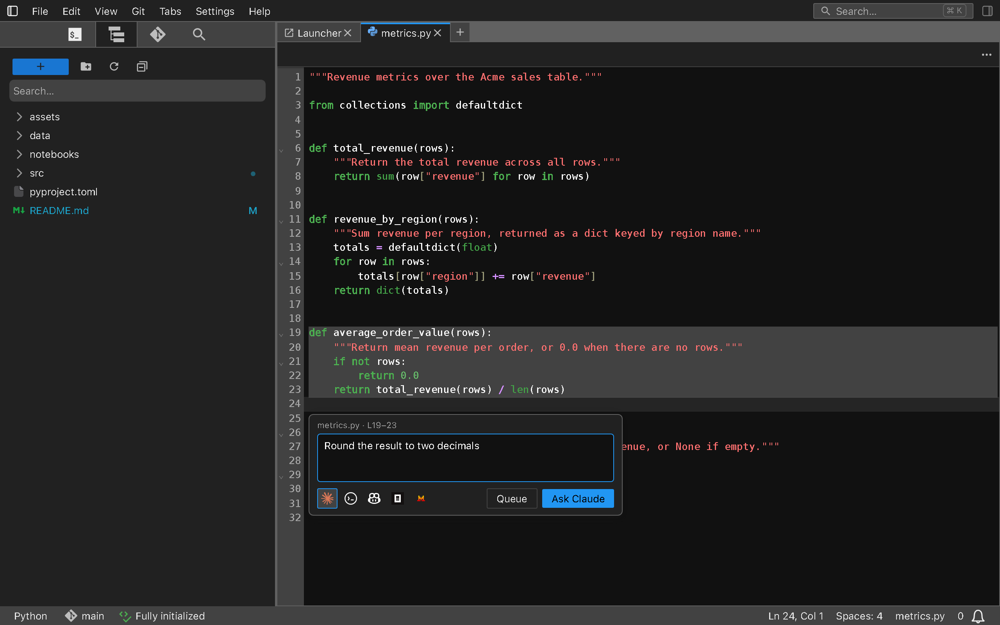

Spot something while reading code? Ask an agent about it without losing your
place.

## From a selection

Select code in a text editor or a notebook cell and a small **Ask agent**
button appears next to the selection (or press
<kbd>Cmd/Ctrl</kbd>+<kbd>.</kbd>). In a [git diff](../git-diffs/), click or
drag over the line numbers and hit the `+` button that shows up in the gutter.

Both open a small prompt box where you describe the change and pick an agent.
The prompt carries your instruction plus the file path, line range, and
selected snippet, so you can request fixes the moment you spot them.

## Send to a running agent

When an agent is already running in a terminal, the prompt box offers it as a
target next to **New terminal**: pick it and the prompt lands in that agent's
input box instead of starting another session, queued by the agent itself if
it is still busy. These sends happen in the background, so your focus stays in
the code you are reading, and a small notification offers to jump to the
terminal.

## Queue prompts while you read

Instead of sending prompts one by one, hit **Queue** in the prompt box (or
press <kbd>Cmd/Ctrl</kbd>+<kbd>Enter</kbd>) while you read through a diff,
leaving a comment on each spot. Every queued prompt remembers the destination
you picked, and a panel in the right sidebar lets you review, edit, retarget,
or remove them before sending everything in one go. Prompts that share a
destination are combined into a single numbered message, and the queue
survives page reloads.
