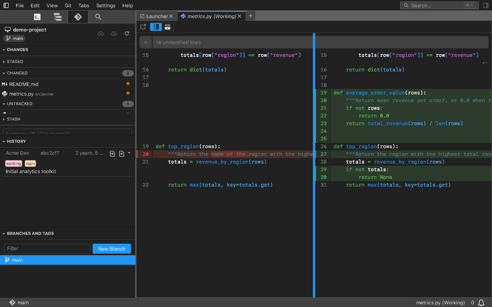

Opening a changed file (from the launcher's **Changes** list or the
`jupyterlab-git` panel) shows a real side-by-side diff, powered by
[`@pierre/diffs`](https://www.npmjs.com/package/@pierre/diffs) for text and
notebooks.

## Edit inside the diff

The working-tree side stays editable, so you can fix a line or discard a hunk
without leaving the diff. Edits are saved straight back to the file.

## Notebook diffs

Notebook diffs get the same treatment: rendered cell by cell, side by side,
and readable, instead of a wall of raw JSON.

## File-type icons

File-type icons from `@pierre/trees` carry across the file browser, document
tabs, and the `jupyterlab-git` panel, so the same file looks the same
everywhere.
