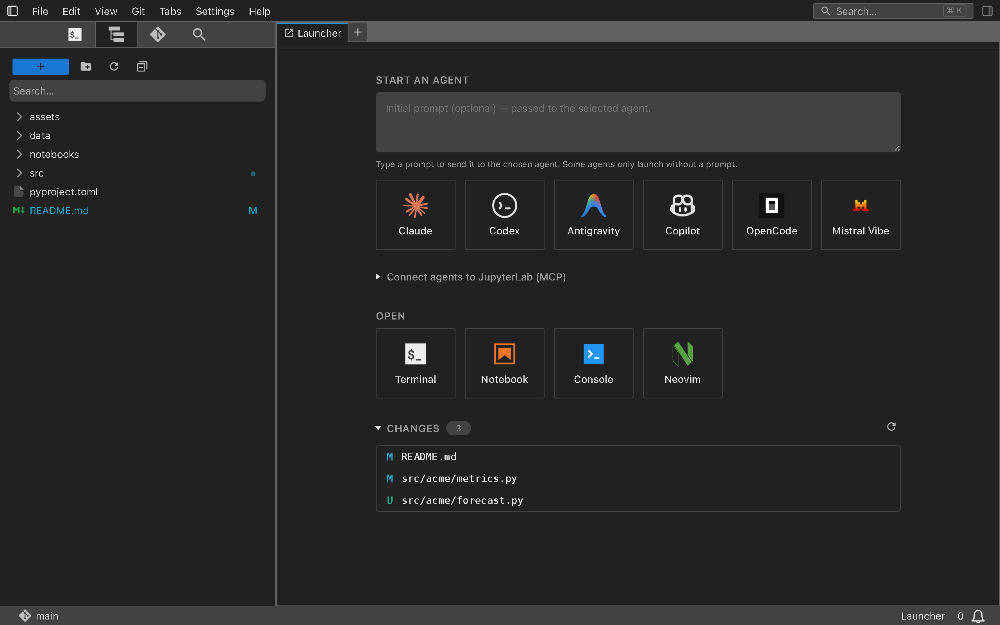

The launcher replaces JupyterLab's stock one with a panel built around how you
actually start work: type an optional prompt, then pick an agent.

## Start an agent

A button shows up for each agent installed on your machine (Claude, Codex,
Antigravity, Copilot, Goose, OpenCode, Kiro, Mistral Vibe) and opens a
terminal that runs it in your project. If you typed a prompt, it is passed to
the agent; some agents only launch without one, and the launcher knows which.

The collapsible **Connect agents to JupyterLab (MCP)** section shows the exact
registration command for each installed agent, with a copy button. See
[Connect agents with MCP](../../agents/mcp/) for what that unlocks.

## Open something else

An **Open** row covers a plain terminal, notebook, console, or your terminal
editor (Neovim, falling back to Vim).

## Jump into the diff

A **Changes** list shows every modified file in the repository and jumps
straight to its [side-by-side diff](../git-diffs/).

## Make it yours

Every agent and editor entry can be overridden, hidden, or extended from the
Settings Editor. See [Launcher entries](../../customize/launcher/).
