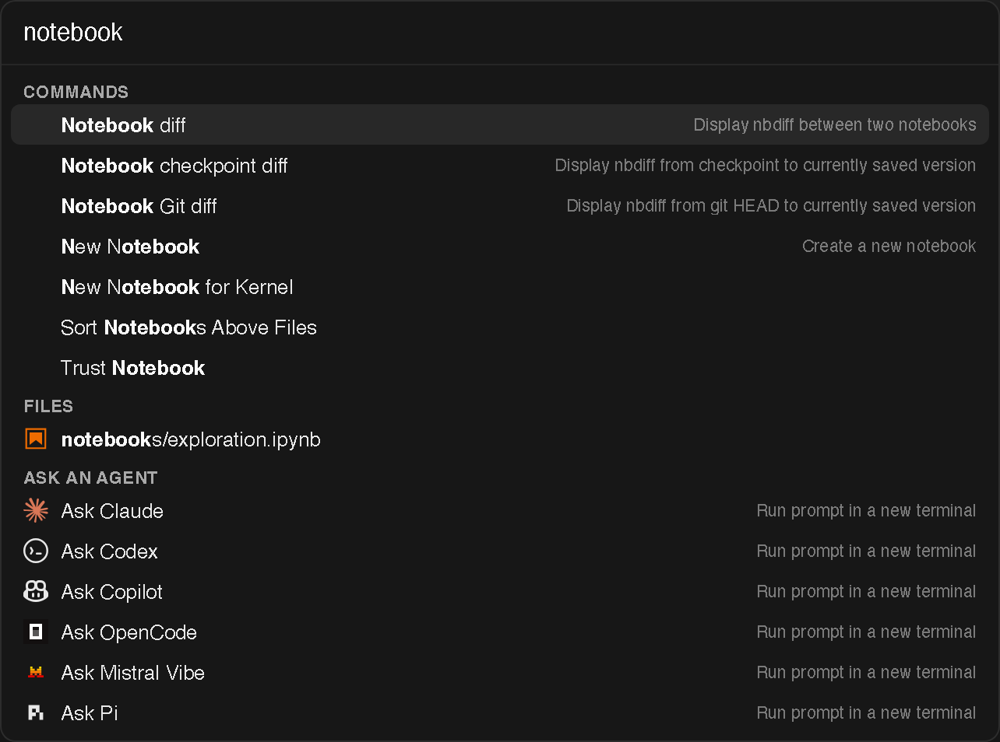

A single pill in the top bar (or <kbd>Cmd/Ctrl</kbd>+<kbd>K</kbd>) opens an
omnibox that fuzzy-matches across your files, every JupyterLab command
(including command palette entries such as switching to a specific theme), and
an **Ask an agent** row that sends whatever you typed to the agent of your
choice.

## Scope the search

Prefix the query with `>` for commands only, or `/` for files only.

## Recents

The commands you run and the files you open through the omnibox are remembered
and offered at the top the next time you open it, so a repeat action is a
single <kbd>Enter</kbd> away. The number of remembered items is configurable
in the omnibox settings.
