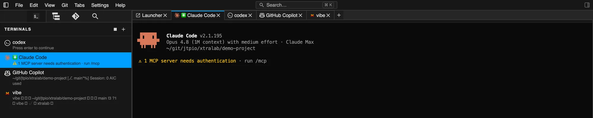

Agents live in terminals, so xtralab makes terminals first-class.



## See what is running

The Terminals panel lists every running session, badges each one with the
agent or editor detected inside it, and shows its latest line of activity, so
a row of running agents stays readable at a glance. Open terminal tabs in the
main area carry the same icon.

## Get notified when an agent needs you

Terminals surface notifications: when a program rings the terminal bell or
emits a notification escape sequence (as coding agents do when they finish a
task or need input), xtralab raises a notification, native in the
[desktop app](../../desktop/) and a web notification in the browser. xtralab
advertises a terminal program agents recognize, so most of them emit these
sequences out of the box.

On macOS the desktop app posts native notifications, which needs a one-time
permission: macOS shows the prompt the first time a notification fires, and
xtralab appears under System Settings > Notifications. If notifications stay
silent, check that entry first: the app can end up listed with notifications
switched off without the prompt ever showing. If xtralab is missing from the
list entirely, macOS is holding a stale registration of the app bundle;
refresh it and relaunch the app:

```sh
/System/Library/Frameworks/CoreServices.framework/Frameworks/LaunchServices.framework/Support/lsregister -f /Applications/xtralab.app
```
